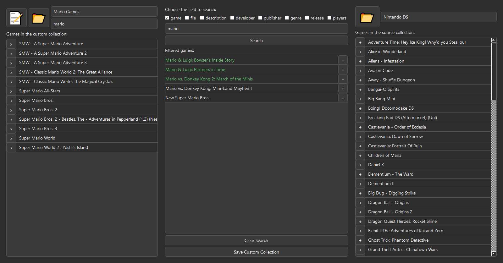
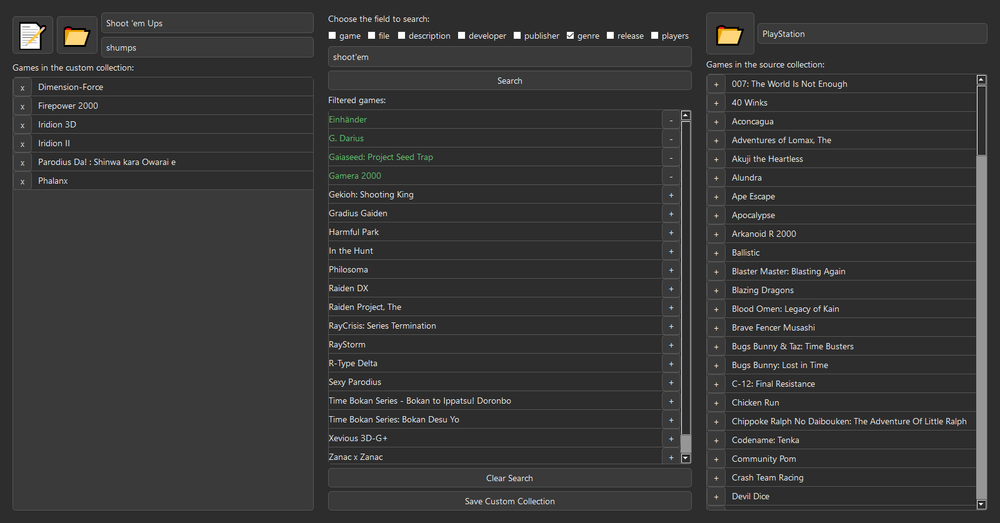

# Pegasus Custom Collection Editor

Pegasus Custom Collection Editor is a graphical tool built with PyQt5 that allows users to create and manage custom collections for [Pegasus Frontend](https://pegasus-frontend.org/). It simplifies the process of selecting, filtering, and organizing games from different `metadata.pegasus.txt` files into a new custom collection.

## Screenshots




## Features

- **Create and Edit Collections**: Open existing `metadata.pegasus.txt` files or create new ones.
- **Game Filtering**: Search for games based on fields like name, description, developer, genre, and more.
- **Absolute Paths**: Automatically retrieves and stores absolute file paths for games.
- **Game Management**: Easily add, remove, or transfer games between collections.

## Roadmap

- Improve UI design and usability.
- Add support for game metadata from other platforms (currently supports only Windows collections).
- Enable support for multiple collections in the same file.
- Refine search functionality for better accuracy.

## Installation

### Requirements

- Python 3.6+
- PyQt5

### Setup

1. Clone this repository:
   ```sh
   git clone https://github.com/luis0henrique/pegasus-custom-collection-editor.git
   cd pegasus-custom-collection-editor
   ```
2. Install dependencies:
   ```sh
   pip install -r requirements.txt
   ```
3. Run the application:
   ```sh
   python 04.py
   ```

## Usage

1. Open or create a new custom collection.
2. Load a source collection to search for games.
3. Use filters to find specific games and add them to your collection.
4. Save your custom collection when you're done.

## Contributing

Feel free to submit issues or pull requests to improve this tool!

## License

This project is licensed under the MIT License.

---

**Note:** This tool is not affiliated with Pegasus Frontend. It is a community-made utility to simplify collection management.

